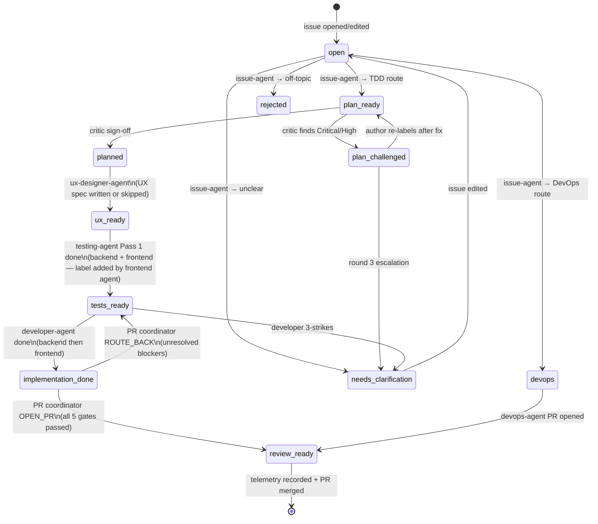

# DarkFactory SDLC Pipeline

End-to-end flow of all agents, labels, triggers, and decision gates.

```mermaid
flowchart TD

    %% ── Entry ────────────────────────────────────────────────────────────────
    ISSUE(["📋 GitHub Issue\nopened / edited / labeled"])

    ISSUE --> IA

    %% ── Issue Agent ──────────────────────────────────────────────────────────
    subgraph IA_BOX["① Issue Agent  •  Trigger: issue.opened / issue.edited"]
        IA["issue-darkfactory.agent.md
        ─────────────────────────────
        1. Relevance check
        2. DevOps route check
        3. Clarity check
        4. Produce implementation plan
        ─────────────────────────────
        Outputs: DoR + DoD comment
        Writes: workflow-state/<N>.json"]
    end

    IA -->|"off-topic"| REJ(["🔴 label: rejected\n(stop)"])
    IA -->|"unclear"| NC1(["🟡 label: needs-clarification\n(wait for edit)"])
    NC1 -->|"issue edited with answers"| ISSUE
    IA -->|"DevOps task\ncomment: /devops-agent proceed"| LBL_DEVOPS(["🏷 label: devops"])
    IA -->|"TDD task\ncomment: /critic proceed"| LBL_SPEC(["🏷 label: plan-ready"])

    %% ── Critic Agent ─────────────────────────────────────────────────────────
    LBL_SPEC --> CA_BOX

    subgraph CA_BOX["② Critic Agent  •  Trigger: label = plan-ready"]
        CA["critic-darkfactory.agent.md
        ─────────────────────────────
        Reads plan only (not issue body)
        6 checks:
          1. Anti-goals / Out-of-scope
          2. Test completeness
          3. AC verifiability
          4. Blast-radius
          5. Slice independence
          6. Plan completeness
        ─────────────────────────────
        Max 3 rounds before escalation"]
    end

    CA -->|"Critical/High findings\n(round 1–2)"| LBL_CHALL(["🏷 label: plan-challenged"])
    LBL_CHALL -->|"author fixes plan\nre-labels plan-ready"| LBL_SPEC
    CA -->|"round 3 still failing"| NC2(["🔴 label: needs-clarification\nHuman review required\n(stop)"])
    CA -->|"no Critical/High\ncomment: /testing-agent proceed"| LBL_PLANNED(["🏷 label: planned"])

    %% ── UX Designer Agent ────────────────────────────────────────────────────
    LBL_PLANNED --> UX_BOX

    subgraph UX_BOX["③ UX Designer  •  Trigger: label = planned"]
        UXD["ux-designer-darkfactory.agent.md
        ─────────────────────────────
        Reads implementation plan
        If frontend changes in scope:
          Produces docs/ux/<N>.md
          (state grid, flows, accessibility,
           data contract)
        If no frontend changes:
          Posts 'UX not required' note
        Adds label ux-ready in both cases"]
    end

    UXD -->|"label: ux-ready"| LBL_UX(["🏷 label: ux-ready"])

    %% ── Testing Agent — Pass 1 ───────────────────────────────────────────────
    LBL_UX --> TA1_BOX

    subgraph TA1_BOX["④ Testing Agent Pass 1  •  Trigger: label = ux-ready\n   Step 1 → Step 2 sequential in one job"]
        TA1B["Step 1 — testing-backend-darkfactory.agent.md
        ─────────────────────────────
        Creates feature branch: feature/<N>-<title>
        Writes failing xUnit tests (red phase)
        Runs dotnet test → confirms all fail
        Commits: 'test: add failing backend tests'
        Does NOT add label or update stage"]

        TA1F["Step 2 — testing-frontend-darkfactory.agent.md
        ─────────────────────────────
        Reads plan + docs/ux/<N>.md (if exists)
        Writes failing Vitest tests
        Includes state-coverage tests from UX spec
        Sets up Vitest infra if absent
        Runs npm test → confirms all fail
        Commits: 'test: add failing frontend tests'
        Adds label tests-ready (final action)"]

        TA1B --> TA1F
    end

    TA1F -->|"label: tests-ready\n(added by frontend agent\nonly after both complete)"| LBL_TESTS(["🏷 label: tests-ready"])

    %% ── Developer Agent ──────────────────────────────────────────────────────
    LBL_TESTS --> DA_BOX

    subgraph DA_BOX["⑤ Developer Agent  •  Trigger: label = tests-ready\n                      OR comment /developer-agent proceed\n   Step 1 → Step 2 sequential in one job"]
        DAB["Step 1 — developer-backend-darkfactory.agent.md
        ─────────────────────────────
        Verifies red phase
        Implements: Models → Service → Controller → DI
        dotnet build → Build succeeded
        dotnet test → iterate until green
        3-strikes rule: max 3 fix attempts
        Commits: 'feat: implement backend #N'
        Posts DoD with DTO contract changes"]

        DAF["Step 2 — developer-frontend-darkfactory.agent.md
        ─────────────────────────────
        Reads backend DoD for DTO changes
        Syncs TypeScript types if DTOs changed
        Implements UI features
        tsc + vite build → must pass
        npm test → all pass
        Commits: 'feat: implement frontend #N'
        Adds label implementation-done"]

        DAB --> DAF
    end

    DAB -->|"3-strikes / discovery report"| NC3(["🔴 label: needs-clarification\nBlocked — human review\n(stop)"])
    DAF -->|"label: implementation-done"| LBL_IMPL(["🏷 label: implementation-done"])

    %% ── Testing Agent — Pass 2 + PR Coordinator ─────────────────────────────
    LBL_IMPL --> PASS2_BOX

    subgraph PASS2_BOX["⑥ Testing Agent Pass 2 + PR Coordinator\n   Trigger: label = implementation-done\n   6 sequential steps in one job"]
        direction TB

        BLIND["Gate 1 — reviewer-darkfactory.agent.md
        ───────────────────────────
        Input: git diff only (no issue, no plan)
        Sweeps 7 structural categories
        TypeScript ↔ C# DTO match
        Min 5 findings or Clean Sweep
        Verdict: APPROVED / CHANGES_REQUESTED"]

        PO["Gate 2 — po-verifier-darkfactory.agent.md
        ───────────────────────────
        Input: issue number (reads plan + impl)
        Maps every AC → impl + test
        ✅ SATISFIED / ⚠️ DRIFT / ❌ MISSING
        Scope creep check + spec-to-impl trace
        Verdict: PO_ACCEPTED / PO_REJECTED"]

        UXR["Gate 3 — ux-reviewer-darkfactory.agent.md
        ───────────────────────────
        Input: docs/ux/<N>.md + implementation
        Five-state audit per component
        Interaction patterns + accessibility
        Data contract null guard check
        Verdict: UX_APPROVED / UX_CHANGES_REQUESTED
                 / UX_SKIPPED (no spec)"]

        TA2B["Gate 4 — testing-backend-darkfactory.agent.md (Pass 2)
        ───────────────────────────
        xUnit coverage review only
        Adds supplementary backend tests
        dotnet test → all pass
        Posts Backend Testing DoD"]

        TA2F["Gate 5 — testing-frontend-darkfactory.agent.md (Pass 2)
        ───────────────────────────
        Vitest coverage review only
        Adds supplementary frontend tests
        npm test → all pass
        Posts Frontend Testing DoD"]

        COORD["Gate 6 — pr-coordinator-darkfactory.agent.md
        ───────────────────────────
        Reads ALL five gate verdicts:
          • Blind Review Report
          • PO Verification Report
          • UX Review Report
          • Backend Testing DoD
          • Frontend Testing DoD
        Decision:
          ROUTE_BACK → posts layered findings,
                       re-labels tests-ready
          OPEN_PR    → opens PR feature/<N>→main,
                       adds label review-ready"]

        BLIND --> PO --> UXR --> TA2B --> TA2F --> COORD
    end

    COORD -->|"ROUTE_BACK\n(unresolved blockers)"| LBL_TESTS
    COORD -->|"OPEN_PR\n(all gates clean)"| LBL_RR(["🏷 label: review-ready"])

    %% ── DevOps Agent (parallel path) ────────────────────────────────────────
    LBL_DEVOPS --> DOA_BOX

    subgraph DOA_BOX["⑦ DevOps Agent  •  Trigger: label = devops\n                    OR comment /devops-agent proceed\n   Uses reusable _run-single-agent.yml"]
        DOA["devops-darkfactory.agent.md
        ─────────────────────────────
        Implements only what plan describes:
        • GitHub Actions workflows
        • Dockerfile / docker-compose
        • appsettings.*.json
        • IaC (Bicep/Terraform) → infra/
        • Health checks in Program.cs
        ─────────────────────────────
        dotnet build + dotnet test must pass
        Never commits secrets
        Creates devops/<N>-<title> branch
        Opens PR → main"]
    end

    DOA -->|"PR opened"| LBL_RR

    %% ── Telemetry Agent ──────────────────────────────────────────────────────
    LBL_RR --> TELEM_BOX

    subgraph TELEM_BOX["⑧ Telemetry Agent  •  Trigger: label = review-ready"]
        TELEM["telemetry-darkfactory.agent.md
        ─────────────────────────────
        Sources:
          • workflow-state/<N>.json
          • Agent 📊 TELEMETRY blocks
          • DoD comments (fallback)
        Outputs:
          • Appends row to telemetry.md
          • Writes daily/<YYYY-MM-DD>.json
          • Overwrites metrics/latest.json
        ─────────────────────────────
        Commit: 'telemetry: record #N'"]
    end

    %% ── Deployment ───────────────────────────────────────────────────────────
    LBL_RR -->|"PR merged to main"| DEPLOY_BOX

    subgraph DEPLOY_BOX["⑧ deploy.yml  •  Trigger: push/PR to main"]
        DEPLOY["1. dotnet build DarkFactory.slnx
        2. dotnet test DarkFactory.slnx
        3. dotnet publish (artifact upload)
        4. Azure Functions deploy
           (OIDC auth — no static secrets)
        ─────────────────────────────
        Deploy step: push to main only"]
    end

    %% ── Observability Layer ──────────────────────────────────────────────────
    TELEM --> OBS_BOX

    subgraph OBS_BOX["⑨ Observability Layer  •  Independent of pipeline handoff — triggered by telemetry"]
        PA["pipeline-analyst-darkfactory.agent.md
        ────────────────────────────────────
        Trigger: /pipeline-analysis comment
                 OR weekly Monday 09:00 UTC
        Source:  docs/pipeline/telemetry.md
        Output:  issue comment health report"]

        PAU["pipeline-audit-darkfactory.agent.md
        ────────────────────────────────────
        Trigger: daily 09:00 UTC
                 OR workflow_dispatch
        Sources: workflow-state/*.json
                 metrics/daily/*.json
        Output:  GitHub Discussion post"]
    end

    %% ── Styling ──────────────────────────────────────────────────────────────
    classDef label   fill:#e8f4fd,stroke:#4a90d9,color:#1a1a2e,font-weight:bold
    classDef stop    fill:#fde8e8,stroke:#d94a4a,color:#1a1a2e
    classDef warning fill:#fdf6e8,stroke:#d9a44a,color:#1a1a2e
    classDef deploy  fill:#e8fde8,stroke:#4ad94a,color:#1a1a2e

    class LBL_SPEC,LBL_DEVOPS,LBL_PLANNED,LBL_UX,LBL_TESTS,LBL_IMPL,LBL_RR,LBL_CHALL label
    class REJ,NC2,NC3 stop
    class NC1 warning
    class DEPLOY_BOX deploy
```



---

## Label State Machine



---

## Agent Authority Matrix

| Agent | Reads | Writes | Labels | Creates |
|---|---|---|---|---|
| issue-agent | issue body | workflow-state | +plan-ready, +devops, +needs-clarification, +rejected, -needs-clarification | plan comment |
| critic-agent | plan comment only | workflow-state | +planned, +plan-challenged, +needs-clarification, -plan-ready | challenge/sign-off comment |
| ux-designer-agent | plan comment | `docs/ux/` only | +ux-ready, -planned | UX spec file, DoD comment |
| testing-backend (P1) | plan comment | `DarkFactory.Weather.Tests/` only | — | feature branch, DoD comment |
| testing-frontend (P1) | plan + UX spec | `dark-factory-ui/` test files only | +tests-ready, -ux-ready | DoD comment |
| developer-backend | plan + test list | `DarkFactory.Weather/` only | — | DoD comment with DTO changes |
| developer-frontend | backend DoD + plan | `dark-factory-ui/src/` only | +implementation-done, -tests-ready | DoD comment |
| reviewer-agent | diff only | — (read-only) | — | Blind Review Report comment |
| po-verifier-agent | plan + impl + dev DoD | — (read-only) | — | PO Verification Report comment |
| ux-reviewer-agent | `docs/ux/<N>.md` + impl | — (read-only) | — | UX Review Report comment |
| testing-backend (P2) | impl only | `DarkFactory.Weather.Tests/` only | — | Backend Testing DoD comment |
| testing-frontend (P2) | impl only | `dark-factory-ui/` test files only | — | Frontend Testing DoD comment |
| **pr-coordinator** | all 4 gate verdicts | — (read-only) | OPEN_PR: +review-ready, -implementation-done / ROUTE_BACK: +tests-ready, -implementation-done | PR (on OPEN_PR), layered findings comment (on ROUTE_BACK) |
| devops-agent | plan | DevOps files only | +review-ready, -devops | devops branch, PR |
| telemetry-agent | workflow-state + DoD comments | telemetry.md, metrics/*.json | — | telemetry row + JSON snapshot |
| pipeline-analyst | telemetry.md | — (read-only) | — | health report comment |
| pipeline-audit | workflow-state + metrics JSON | — (read-only) | — | GitHub Discussion |

---

## Execution Trigger Map

| Workflow | Triggers on | Condition |
|---|---|---|
| `issue-agent.yml` | `issues: [opened, edited, labeled]` | none of: plan-ready, plan-challenged, planned, ux-ready, rejected, devops, tests-ready, implementation-done, review-ready |
| `critic-agent.yml` | `issues: [labeled]` | label = `plan-ready` |
| `ux-agent.yml` | `issues: [labeled]` | label = `planned` |
| `testing-agent.yml` (Pass 1) | `issues: [labeled]` | label = `ux-ready` |
| `testing-agent.yml` (Pass 2) | `issues: [labeled]` | label = `implementation-done` |
| `developer-agent.yml` | `issues: [labeled]`, `issue_comment: [created]` | label = `tests-ready` OR comment contains `/developer-agent proceed` |
| `devops-agent.yml` | `issues: [labeled]`, `issue_comment: [created]` | label = `devops` OR comment contains `/devops-agent proceed` — uses `_run-single-agent.yml` |
| `telemetry-agent.yml` | `issues: [labeled]` | label = `review-ready` |
| `pipeline-analyst.yml` | `schedule`, `issue_comment: [created]` | cron `0 9 * * 1` (Mon) OR comment contains `/pipeline-analysis` |
| `pipeline-audit.yml` | `schedule`, `workflow_dispatch` | cron `0 9 * * *` (daily) |
| `deploy.yml` | `push` to main, `pull_request` to main | always |

---

## Pass 2 Quality Gates (testing-agent.yml job)

Six sequential steps in a single GitHub Actions job triggered by `implementation-done`:

```
Step 1: reviewer-agent          (diff only → structural quality → APPROVED / CHANGES_REQUESTED)
Step 2: po-verifier-agent       (plan compliance → PO_ACCEPTED / PO_REJECTED)
Step 3: ux-reviewer-agent       (UX plan compliance → UX_APPROVED / UX_CHANGES_REQUESTED / UX_SKIPPED)
Step 4: testing-backend P2      (xUnit coverage — no gate reads)
Step 5: testing-frontend P2     (Vitest coverage — no gate reads)
Step 6: pr-coordinator          (reads all 5 verdicts → ROUTE_BACK or OPEN_PR)
```

**Information boundaries:**
- Steps 1–5 are independent: each reads only its own inputs and produces its own verdict.
- Step 3 (UX reviewer) reads `docs/ux/<N>.md`; if no spec exists it emits `UX_SKIPPED` and is treated as neutral by pr-coordinator.
- Step 6 (pr-coordinator) is the sole aggregator and routes findings by layer: backend findings to developer-backend, frontend/UX findings to developer-frontend.

